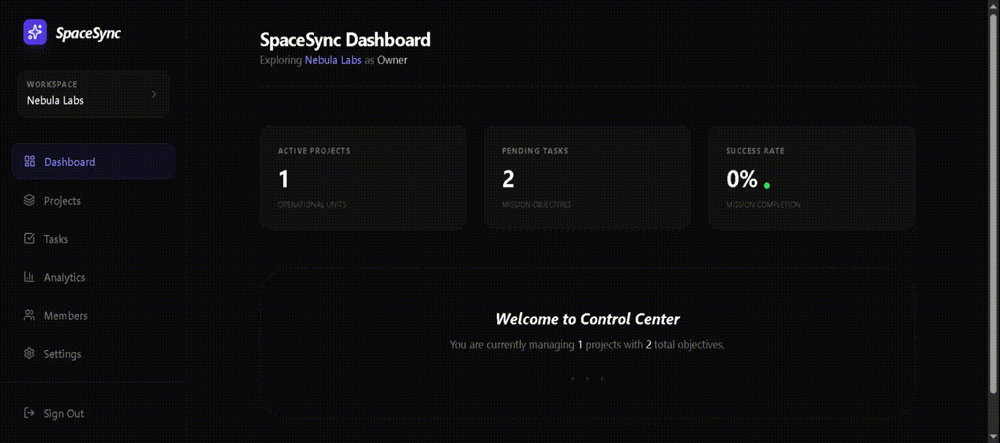

# 🚀 SpaceSync

> A modern, full-stack project management SaaS application built with Next.js 15 and Supabase.

**Live Demo:** [https://space-sync-nine.vercel.app/login](https://space-sync-nine.vercel.app/login)




## ✨ Features

### 🏢 Multi-Tenant Workspaces
- Create and manage isolated workspaces
- Invite team members with role-based access (Owner, Admin, Member)
- Secure data isolation with Row Level Security (RLS)

### 📋 Project Management
- Create projects with descriptions and auto-generated slugs
- Kanban-style task boards with drag-and-drop
- Task assignment to team members
- Priority levels (Low, Medium, High, Urgent)

### 📊 Analytics Dashboard
- Real-time task statistics
- Status distribution charts
- Priority breakdown visualization
- Project workload analysis

### 🎨 Modern UI/UX
- Dark theme with glassmorphism effects
- Responsive design (mobile-first)
- Smooth animations with Tailwind CSS
- Toast notifications for user feedback

## 🛠️ Tech Stack

| Category | Technology |
|----------|------------|
| **Framework** | Next.js 15 (App Router) |
| **Language** | TypeScript |
| **Database** | Supabase (PostgreSQL) |
| **Auth** | Supabase Auth |
| **Styling** | Tailwind CSS |
| **Charts** | Recharts |
| **Drag & Drop** | dnd-kit |
| **Notifications** | Sonner |

## 📁 Project Structure

```
src/
├── actions/          # Server Actions (API layer)
│   ├── auth.ts       # Authentication actions
│   ├── workspace.ts  # Workspace management
│   ├── project.ts    # Project CRUD
│   ├── task.ts       # Task management
│   ├── member.ts     # Team member actions
│   └── analytics.ts  # Analytics aggregation
├── app/
│   ├── (auth)/       # Auth pages (login, register)
│   └── (dashboard)/  # Protected dashboard routes
├── components/
│   ├── dashboard/    # Dashboard components (Sidebar)
│   ├── kanban/       # Kanban board components
│   └── providers/    # React context providers
├── lib/
│   └── supabase/     # Supabase client configuration
└── types/
    └── database.ts   # TypeScript type definitions
```

## 🚀 Getting Started

### Prerequisites.

- Node.js 18+
- npm or yarn
- Supabase account

### Installation

1. Clone the repository
```bash
git clone https://github.com/yourusername/spacesync.git
cd spacesync
```

2. Install dependencies
```bash
npm install
```

3. Configure environment variables
```bash
cp .env.example .env.local
```

Add your Supabase credentials:
```env
NEXT_PUBLIC_SUPABASE_URL=your_supabase_url
NEXT_PUBLIC_SUPABASE_ANON_KEY=your_anon_key
```

4. Run the development server
```bash
npm run dev
```

5. Open [http://localhost:3000](http://localhost:3000)

## 🗄️ Database Schema

The application uses the following main tables:

- **profiles** - User profiles (synced with auth.users)
- **workspaces** - Multi-tenant workspace containers
- **workspace_members** - User-workspace relationships with roles
- **projects** - Project containers within workspaces
- **tasks** - Individual tasks with status, priority, and assignments

All tables are protected with Row Level Security (RLS) policies.

## 🔒 Security Features

- ✅ Row Level Security (RLS) on all tables
- ✅ Server-side authentication checks
- ✅ Role-based access control (RBAC)
- ✅ Input validation on server actions
- ✅ Secure cookie-based session management

## 📱 Screenshots

### Dashboard
A clean overview of your workspace statistics and recent activity.

### Kanban Board
Drag-and-drop task management with real-time status updates.

### Analytics
Visual insights into your team's productivity and task distribution.

## 🤝 Contributing

Contributions are welcome! Please feel free to submit a Pull Request.

## 📄 License

This project is licensed under the MIT License.

---

Built with ❤️ using Next.js and Supabase
